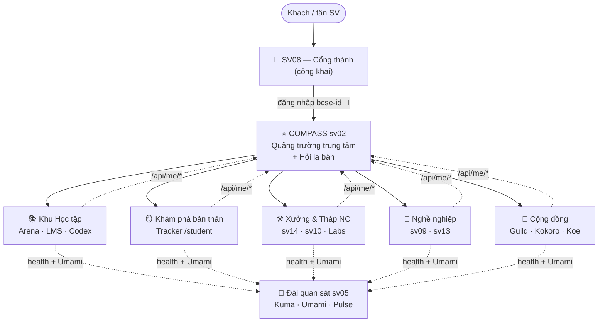

# 🏰 MASTERPLAN "Lâu đài BCSE" — bản đồ hệ thống chung

> Lập 2026-08-25 (phiên thiết kế với GĐCT). **v1 ĐÃ CHỐT** (3 quyết định vòng duyệt 1 — xem §7).
> Vị trí trong bộ tài liệu: STRATEGY-2026 = *chẩn đoán* (vì sao), MASTER-PLAN-2026 = *lộ trình*
> (làm gì, thứ tự nào), tài liệu này = **bản đồ không gian** (cái gì nằm ở đâu, lối đi thế nào,
> trải nghiệm ra sao). Chỉ đạo gốc: *"như thiết kế một lâu đài — cần biết khu vực cho từng nhà
> chức năng, lối đi, trải nghiệm, rồi mới đi sâu thiết kế từng tòa."*
> Quy tắc dùng: mọi đề xuất nâng cấp một cổng phải chỉ được vị trí của nó trên bản đồ này trước.

## 1. Ẩn dụ nền — lâu đài trả lời 3 câu hỏi

| Câu hỏi | Trong lâu đài | Trong hệ |
|---|---|---|
| Khu vực nào cho nhà chức năng nào? | Các **khu phố** trong tường thành | 6 zone dưới đây |
| Lối đi giữa các khu? | Cổng thành → quảng trường → đường phố | SSO + điều hướng + đường dữ liệu (§3) |
| Trải nghiệm cư dân? | Hành trình cư dân từ ngày nhập thành | Hành trình SV 4 năm (§4) |

## 2. Bản đồ khu chức năng (zones)

**Kết cấu nền (không phải khu — là hạ tầng mọi khu dùng chung):**

| Kết cấu | Ẩn dụ | Thành phần |
|---|---|---|
| bcse-id | **Thẻ cư dân** — một thẻ mở mọi cửa | SSO OIDC; sau này kiêm **ngân khố điểm** senpai–kohai (ledger) |
| SV08 | **Cổng thành + tường thành** — mặt tiền công khai | bcse-intro: giới thiệu chương trình, bản đồ dịch vụ, cho khách + SV chưa login |
| Compass (sv02) | **Quảng trường trung tâm** — vào thành là đứng đây | Hub chính SV sau login; launcher hành trình; "Hỏi la bàn" (AI Advisor kế thừa) |
| sv05 Ops Center | **Đài quan sát** | Kuma + Umami (cho quản thành) + Pulse công khai (bảng tin sức khỏe thành) |

**6 khu phố:**

| # | Khu | Ẩn dụ | Cổng | Phục vụ chính | Hạng hiện tại |
|---|---|---|---|---|---|
| 1 | **Học tập** | Sân luyện + giảng đường + thư viện | Arena sv12 (sân luyện — tầm nhìn ladder LeetCode: nhập môn → căn bản → OOP → nâng cao + ICPC/DSA) · LMS sv20 (giảng đường môn trong kỳ) · Codex sv16 (thư viện chưng cất — kế hoạch gộp vào sv20, B12.1) | Mọi năm, trọng tâm năm 1–2 | Core learning |
| 2 | **Khám phá bản thân** | Gương soi | Tracker sv18 `/student` (soi bảng điểm, rà tích lũy, framing tích cực) · phần cá nhân hóa của Compass (v2+) | Mọi năm | Core winner |
| 3 | **Xưởng & Tháp nghiên cứu** | Xưởng rèn + tháp | Hardware sv14 (xưởng — năm 2+) · In 3D sv10 · Labs sv03/sv17/sv19 (tháp nghiên cứu — đọc hướng nghiên cứu GV, gia nhập nhóm NCKH năm 3) | Năm 2–3 | sv14 Core; labs Frozen chờ nhóm thật (P4) |
| 4 | **Nghề nghiệp** | Cầu ra thế giới | Career sv09 (mạng DN — xem: mọi khóa; quy trình thực tập: năm 3) · Thesis sv13 (đại sảnh bảo vệ KLTN) · Showcase (tương lai, mở khi có DN thật hỏi) | Năm 3–4 | Core / Core seasonal |
| 5 | **Cộng đồng** | Hội quán + vườn + hòm thư | Guild sv15 (hội quán senpai–kohai: hỏi đáp ẩn danh, reward ledger — build sau N8) · Kokoro sv06 (vườn tĩnh tâm — phân phối mùa thi) · Koe (hòm thư tiếng nói SV, chưa mở) | Mọi năm | Frozen có lộ trình |
| 6 | **Hậu cần** (ngoài tường) | Nhà kho ngoài thành | e-service sv04 (kế toán trường — ngoài hệ BCSE, giữ chạy) · sv01 (1 GV dùng, kệ đó) · sv07 Aura Brew (cá nhân) | Không phải SV | Ngoài hệ |

## 3. Lối đi — 3 tầng

1. **Lối định danh (thẻ cư dân):** bcse-id SSO phủ mọi cổng Core — một tài khoản Google VJU,
   tự định danh lần đăng nhập đầu. Ngân khố điểm senpai–kohai đặt tại bcse-id (ledger tập trung,
   mọi khu tiêu/thưởng chung một sổ). Dashboard bcse-id thu về trang tài khoản + SSO.
2. **Lối điều hướng (đường cho người):** một trục duy nhất
   `SV08 (công khai) → login → Compass (quảng trường) → khu → app`.
   Chuẩn: mọi app Core có đường quay về Compass (logo/nút hub); Compass mời theo **nhu cầu +
   thời điểm** (widget "Tuần này", lời dẫn hành trình), không khóa cứng theo năm — app tiện ích
   tự nói công dụng (quyết định D6). SV chỉ cần nhớ 1 URL (sv08) — mọi thứ khác được dẫn.
3. **Lối dữ liệu (đường cho hàng hóa):**
   - `app → Compass`: mỗi app nguồn mở `/api/me/*` (SV-safe view, privacy by design của COMPASS-DESIGN).
   - `app → Đài quan sát`: `/api/health` + VERSION (A5) + Umami snippet (N0 — đã phủ 5/5 Core).
   - `hoạt động → di sản`: chuẩn N7 (trang distilled, repo di sản) — mọi khu đổ về thư viện.

## 4. Trải nghiệm chuẩn theo hành trình 4 năm

| Năm | Kịch bản trải nghiệm (mỗi câu = một lối đi phải thông) |
|---|---|
| **Năm 1** | Tuần định hướng nhận **thẻ cư dân** (login Google VJU lần đầu = có bcse-id) → đứng ở **quảng trường** thấy "Tuần này của bạn" → vào **sân luyện** tầng nhập môn (Arena ladder) → lạ nước lạ cái thì **hỏi la bàn** hoặc hỏi ẩn danh ở **hội quán** (senpai trả lời, nhận điểm) |
| **Năm 2** | Giảng đường (LMS môn trong kỳ, Arena gắn điểm thành phần) → lần đầu vào **xưởng rèn** sv14 (năm 2 mở cửa) → soi **gương** Tracker xem tích lũy → bắt đầu đọc các **tháp nghiên cứu** xem mình thích hướng nào |
| **Năm 3** | Gia nhập một **tháp** (nhóm NCKH thật — N5) → sân luyện tầng cao (ICPC/DSA) → lên **cầu** sv09 theo mốc HD483 → làm senpai ở hội quán (tích điểm ngân khố) |
| **Năm cuối** | **Cầu ra thế giới** (thực tập → việc làm) → **đại sảnh** bảo vệ KLTN (sv13, special access sv14) → **để lại di sản** vào thư viện (N7) → tên lên tường thành (Showcase, khi mở) |
| **Xuyên suốt** | Mệt thì ra **vườn tĩnh tâm** (Kokoro, được mời đúng lúc mùa thi); có điều muốn nói thì bỏ **hòm thư** Koe; mọi bước chân được đài quan sát đo (Umami) để thành phố tự sửa mình |

## 5. Chuẩn xây dựng chung (building code — mọi tòa phải đạt trước khi nâng cấp riêng)

1. `/api/health` trả SHA + VERSION (A5) — ✅ 5/5 Core
2. Umami snippet (N0) — ✅ 5/5 Core + id
3. SSO bcse-id (app Core có định danh SV)
4. Mobile "ít chữ, không thu nhỏ chữ" (quy tắc 25/8)
5. `/api/me/*` SV-safe view — khi khu đó đến lượt nối vào Compass
6. Repo GitHub private + deploy tái lập được (hướng tới B8: 1 deployer chuẩn)
7. Di sản cuối kỳ theo chuẩn N7 (áp cho hoạt động, không chỉ code)

## 6. Trình tự xây (không đổi nhịp hiện hành — bản đồ chỉ định vị, không giục)

Nhịp tim D-series → boring-solid + backlog A/B trong kỳ → **triage tháng 10 bằng WAU** →
rồi mới đi sâu từng tòa theo thứ tự: **Compass v1** (quảng trường phải có trước khi trang trí
các khu) → Arena ladder → theo lực kéo đo được. Guild/reward chỉ sau N8 chạy tay ổn ≥1 tháng.
Mỗi thời điểm giữ đúng quy tắc: ≤2 hạng mục kỹ thuật + 1 hạng mục con người.

## 7. ✅ Ba quyết định vòng duyệt 1 (thầy chốt 25/8)

1. **Ngân khố điểm đặt ở bcse-id** — mọi khu dùng chung một sổ ledger gắn danh tính: giúp ở Guild
   được điểm, tiêu ở bất kỳ khu nào (ưu tiên booking sv14, đổi quà…), sống xuyên suốt 4 năm,
   app đọc qua API. Chi tiết kỹ thuật chốt sau N8.
2. **Ẩn dụ lâu đài ĐƯA VÀO UI CHO SV** — Compass hiển thị các khu như **bản đồ thành/lâu đài**
   (không chỉ là ngôn ngữ thiết kế nội bộ). Hệ quả: Compass v1 cần vòng mockup visual riêng
   (2–3 mẫu bản đồ cho thầy + SV thật chọn, theo đúng quy trình duyệt mẫu như Pulse); ngôn ngữ
   khu/ẩn dụ trong §2 trở thành ngôn ngữ sản phẩm — đặt tên khu cần trau chuốt thêm ở vòng mockup.
3. **Arena ladder ∥ LMS evergreen — song song, 2 vai rõ:** LMS = môn có cohort trong kỳ +
   evergreen học lại (lý thuyết, bài giảng); Arena = sân luyện code quanh năm theo ladder
   (nhập môn → ICPC/DSA), gắn điểm thành phần khi môn cần. Hai tòa bổ trợ, không thay nhau.
